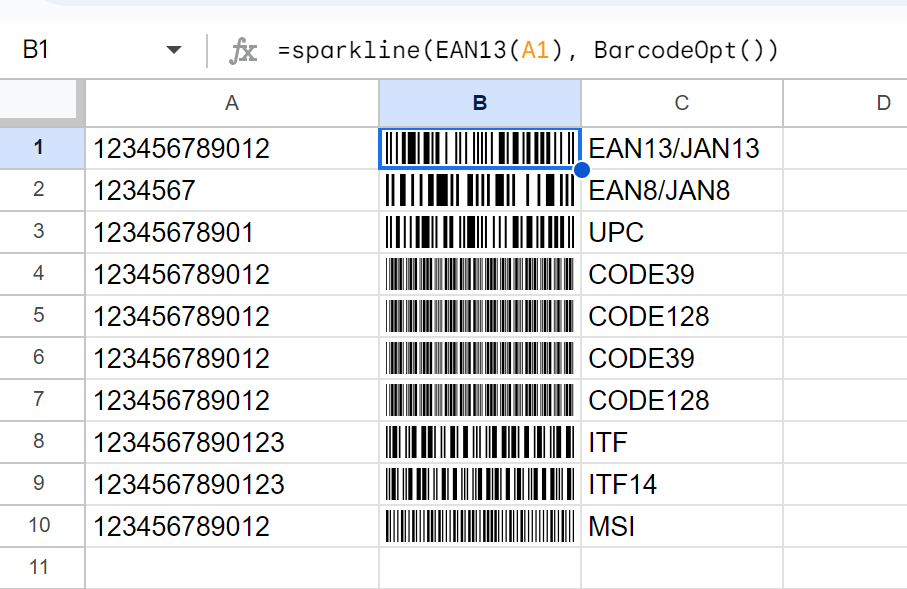

# Google SpreadSheet Barcode Generator
[日本語](README.ja.md) &nbsp;&nbsp;&nbsp;&nbsp; [中文](README.zh.md)<br>
Google SpreadSheet is a highly practical online spreadsheet system.<br>
However, it lacks sufficient support for barcode generation; currently, the only method available online is simple barcode generation using the Libre Barcode font.<br>
This method does not produce ideal barcodes, such as EAN/JAN codes, and does not support a comprehensive range of formats.
To support a wider array of barcode formats, I utilized a mature js library - [JsBarcode](https://github.com/lindell/JsBarcode "JsBarcode is a barcode generator written in JavaScript").<br>
Using the underlying functionality of JsBarcode to generate barcode data, I used Google SpreadSheet's Sparkline function to draw the barcode graphics. This drawing approach was inspired by [this repository](https://github.com/EszopiCoder/google-barcode-fx-library "Barcode Function Library for Google Sheets").<br>
However, due to the limited drawing capabilities of the Sparkline function, it cannot draw text, variable line lengths, etc., which is a drawback.

Also, this library utilizes [clasp](https://github.com/google/clasp) for local development of GAS (Google Apps Script). For more details, see the related documentation.

# Basic Usage Process:
## 1. Clone the code
```shell
git clone https://github.com/tomcatliu2016/jsbarcode-spreadsheet-connector
```
## 2. Install dependencies
```shell
cd jsbarcode-spreadsheet-connector && npm install
```
## 3. Log in with clasp
```shell
clasp login
```
## 4. Create a GAS project or set an existing project's Script ID to .clasp.json
```shell
clasp create --type sheets --title "JsBarcodeSpreadSheetConnector" --rootDir ./dist
```
## 5. build locally
```shell
npm run build
```
## 6. Push the code to GAS server
```shell
clasp push
```
## 7. Complete the compile and push steps at once
```shell
npm run deploy
```
## 8. Open the Google SpreadSheet and use the custom function
```shell
clasp open
```
## 9. Use the custom function in the Google SpreadSheet
```shell
=sparkline(EAN13(A1), BarcodeOpt())
```

# Sample Image
[]