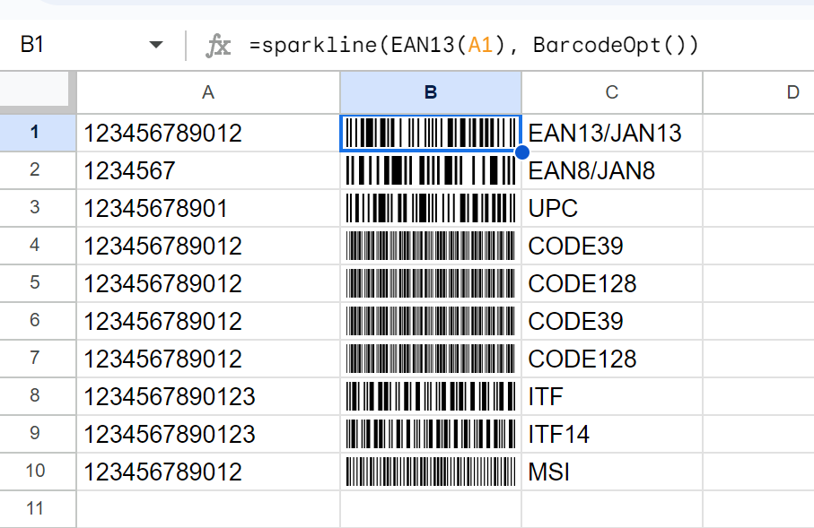

# Google SpreadSheet用的条码生成器
[日本語](README.ja.md) &nbsp;&nbsp;&nbsp;&nbsp; [en](README.md)<br>
Google SpreadSheet是一个非常实用的在线电子表格系统。<br>
但是对于条码生成的支持非常缺乏，目前网上能找到的就是简单的利用Libre Barcode字体生成条码。<br>
这种方式生成的条码不是很理想，比如EAN/JAN code，支持的格式也不全面。
为了支持更加广泛格式的条码生成，我利用了成熟的js库 - [JsBarcode](https://github.com/lindell/JsBarcode "JsBarcode is a barcode generator written in JavaScript")。<br>
以JsBarcode的底层生成条码数据，利用Google SpreadSheet的Sparkline函数来绘制条码图形。这个绘制思路受到[此库](https://github.com/EszopiCoder/google-barcode-fx-library "Barcode Function Library for Google Sheets")的启发。<br>
但是由于Sparkline函数的绘制功能有限，不能绘制文本，长短线等，这是一个缺点。

另外本库利用了[clasp](https://github.com/google/clasp)来进行GAS(Google Apps Script)的本地开发，如果不清楚可以查看相关文档。

# 利用的基本流程：
## 1. clone代码
```shell
git clone https://github.com/tomcatliu2016/jsbarcode-spreadsheet-connector
```
## 2. 安装依赖库
```shell
cd jsbarcode-spreadsheet-connector && npm install
```
## 3. clasp登录
```shell
clasp login
```
## 4. 创建GAS项目或者设置已有项目的Script ID到.clasp.json
```shell
clasp create --type sheets --title "JsBarcodeSpreadSheetConnector" --rootDir ./dist
```
## 5. 本地编译
```shell
npm run build
```
## 6. 将编译好的代码推送到GAS的服务端
```shell
npm run push
```
## 7. 编译和推送步骤一次完成
```shell
npm run deploy
```
## 8. 打开Google SpreadSheet
```shell
clasp open
```
## 9. 在Google SpreadSheet中使用自定义函数
```shell
=sparkline(EAN13(A1), BarcodeOpt())
```

# 效果图
[]